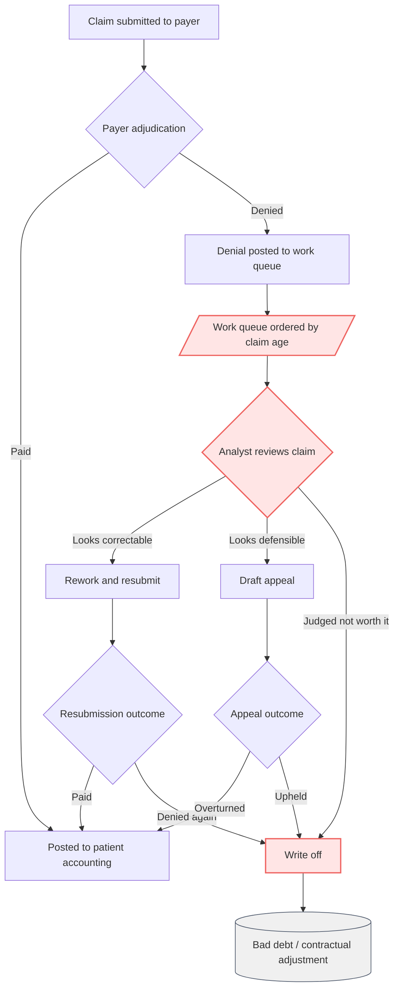
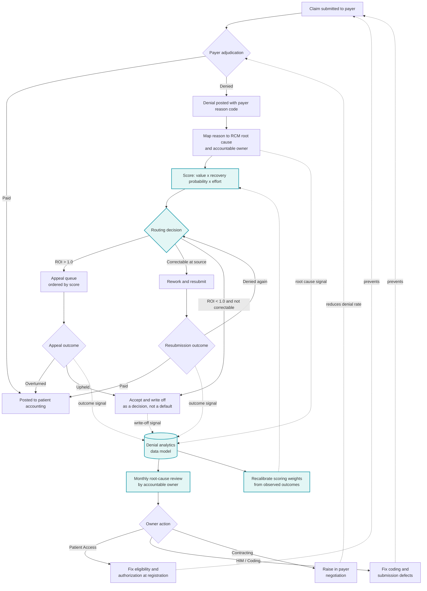
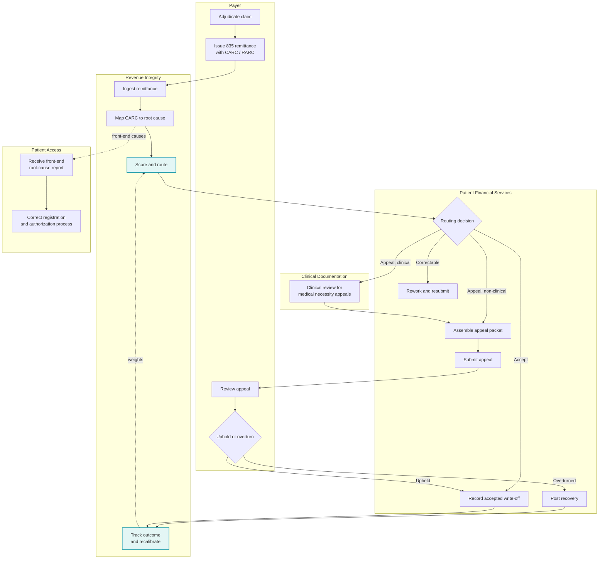

# Process Maps — Claims to Cash, Denial Handling

Document ID: PM-RCM-DEN-001 · Companion to `BRD.md`

These maps cover the claims-to-cash flow from the point a claim is submitted to the
point it is paid, appealed, or written off. Pre-submission registration and coding
appear only where they originate a denial, since that is where prevention sits.

---

## 1. As-is: denial handling today

The defining characteristic of the current process is that **the denial work queue is
ordered by claim age**, and that **no path returns root-cause information upstream**.
A denial caused by an eligibility error at registration is worked, written off, and
forgotten without Patient Access ever learning it happened.

### Pain points

| ID | Pain point | Where | Evidence | Requirement |
|---|---|---|---|---|
| PP-01 | Work queue ordered by age, not value | Step E | A $60 administrative denial and a $40,000 inpatient denial rank identically | BRD-028 |
| PP-02 | Appeal decision is unaided individual judgement | Step F | No standard threshold; outcomes are not fed back into the decision | BRD-019 |
| PP-03 | No root-cause feedback loop to originating department | Whole flow | No arrow returns upstream; Patient Access never learns which registrations caused denials | BRD-010, BRD-011 |
| PP-04 | Write-off is a default, not a decision | Step I | Nationally 99.75% of denials are never appealed while 39.7% of appeals succeed | BRD-018, BRD-019 |
| PP-05 | No payer-level performance visibility | Whole flow | Denial behavior never enters payer negotiation | BRD-025, BRD-026 |
| PP-06 | Denial reason is not translated into an internal cause | Step D | Payer reason codes are stored but never mapped to a process owner | BRD-010 |

---

## 2. To-be: value-ordered denial management with a prevention loop

Two structural changes. First, the work queue is **scored and routed** rather than
age-ordered, and the score decides prevention versus appeal versus accept. Second, a
**root-cause feedback loop** returns denial patterns to the department that can prevent
them, which is the only path that reduces denial volume rather than reworking it.

### What changes

| Change | From | To | Requirement |
|---|---|---|---|
| Queue ordering | Claim age | Composite priority score | BRD-028 |
| Appeal decision | Analyst judgement | ROI threshold with per-category flag | BRD-019 |
| Root cause | Not captured | Mapped to owner at denial posting | BRD-010, BRD-011 |
| Write-off | Default outcome | Explicit decision when ROI < 1.0 | BRD-018 |
| Prevention | No mechanism | Monthly owner review driven by root-cause signal | BRD-020 |
| Scoring weights | n/a | Recalibrated from observed appeal outcomes | BRD-022 |
| Payer performance | Invisible | Benchmarked and fed to Contracting | BRD-025, BRD-026 |

---

## 3. Swimlane: appeal decision and execution (to-be)

---

## 4. RACI

| Activity | Revenue Integrity | Patient Financial Services | Patient Access | HIM/Coding | Clinical Doc | Contracting | Finance |
|---|---|---|---|---|---|---|---|
| Maintain denial root-cause taxonomy | **A/R** | C | C | C | C | I | I |
| Score and route denials | **A/R** | C | I | I | I | I | I |
| Rework and resubmit | I | **A/R** | I | C | I | I | I |
| Assemble and submit appeals | C | **A/R** | I | C | **R** (clinical) | I | I |
| Prevent front-end denials | C | I | **A/R** | I | I | I | I |
| Prevent coding denials | C | I | I | **A/R** | C | I | I |
| Raise denial performance with payers | C | I | I | I | I | **A/R** | C |
| Approve the value model and dollar figure | **R** | C | I | I | I | I | **A** |
| Approve accepted write-offs | C | **R** | I | I | I | I | **A** |

A = Accountable, R = Responsible, C = Consulted, I = Informed

---

## 5. Where denials originate

Mapping each payer-reported denial reason to the process step that causes it. This is
the bridge from "the payer denied it" to "our process caused it," and it is what makes
an owner assignment possible.

| Payer denial reason | Originating process step | RCM stage | Accountable owner | Preventable at source |
|---|---|---|---|---|
| Referral required | Authorization capture at scheduling | Front-End | Patient Access | High |
| Member not covered | Eligibility verification at registration | Front-End | Patient Access | High |
| Out of network | Network verification at scheduling | Front-End | Patient Access | Moderate |
| Administrative reason | Claim assembly and submission | Mid-Cycle | HIM / Coding | High |
| Not medically necessary | Clinical documentation at point of care | Clinical | Clinical Documentation | Moderate |
| Not medically necessary (behavioral) | Clinical documentation at point of care | Clinical | Clinical Documentation | Moderate |
| Investigational / experimental | Coverage policy check before service | Clinical | Utilization Management | Low |
| Service excluded | Benefit verification at scheduling | Benefit Design | Contracting / Benefits | Low |
| Benefit limit reached | Benefit verification at scheduling | Benefit Design | Contracting / Benefits | Low |
| Other | Not determinable from payer reporting | Unclassified | Revenue Integrity | Unknown |

> **Constraint.** 60% of classified denials are reported as "Other." Until CARC/RARC
> detail is obtained from internal remittance data (open item OI-01), the largest
> single denial category cannot be assigned a real owner. This is the binding limit on
> root-cause management and is captured as BRD-021.
